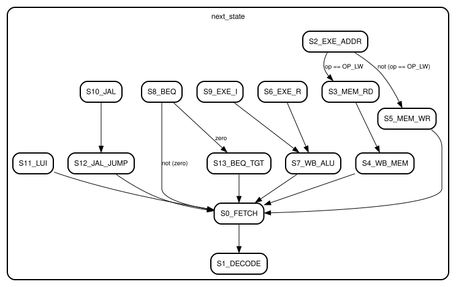

# Lab Report: Multi-Cycle RISC-V Processor

**Name:** Leon Adomaitis
**Date:** 2025-12-19

## 1. System Diagram
The system structure has been updated to meet the modular controller requirements. The detailed schematic below is auto-generated from the synthesized hardware.

## 2. Finite State Machine (FSM)
The following schematic is auto-generated from the synthesized FSM hardware:

The controller executes the following state transitions (states S0-S13). Note the optimized BEQ logic where the comparison happens in S8, and the transition to Target Calculation (S13) is conditional on the Zero flag.

- **S0_FETCH**: Fetch Instr, PC=PC+4.
- **S1_DECODE**: Decode, Read Regs.
- **S9_EXE_I / S6_EXE_R**: Execute.
- **S11_LUI**: Load Upper Immediate.
- **S10_JAL / S12**: Link (Save PC+4) then Jump.
- **S8_BEQ / S13**: Compare (SUB) then Loop/Update PC.

## 3. System Architecture Analysis (Section 4.1)

**Q1: Why do some registers have write enable (en) while others do not?**
Registers defining architectural state (PC, IR, RegFile, Memory) or precise multi-cycle flow control must only update at specific FSM states. For example, `IR` must hold the instruction stable throughout execution, so `we_ir` is only active in `S0`.
Registers like `A`, `B`, and `ALUOut` capture data every cycle. This is acceptable (and saves control logic) because the FSM controls the Muxes and Writes of subsequent stages to only use this data when it is valid.

**Q2: Why is the output of the sign extender not registered?**
The Sign Extender is a purely combinational circuit with low delay. Registering it would introduce an extra clock cycle of latency, requiring an additional FSM state for every instruction using an immediate, increasing CPI without providing any frequency benefit.

**Q3: Where is the slowest datapath (critical path)?**
The critical pathh determines the minimum clock period. In this architecture, it is arguably the **Fetch Stage**: `CLK -> PC_Reg -> Mem (Read) -> IR_Setup`. Memory access is typically the slowest operation. Alternatively, the **Execute Stage** (`CLK -> A/B_Reg -> Mux -> ALU -> ALUOut_Setup`) involves the ALU carry chain.

**Q4: How does a multicycle architecture allow the clock period to be shorter than in a single-cycle one? What is the benefit?**
In a single-cycel processor, the clock period $T_{clk}$ must be long enough for the *slowest instruction* to complete entirely (Fetch + Decode + Execute + Mem + WB). In a multi-cycle processor, $T_{clk}$ is determined by the *slowest single stage*. Since one stage is much shorter than the sum of all stages, the clock frequency can be much higher.

**Q5: Why might a multicycle design be easier (or harder) to extend with new instructions compared to a single-cycle design?**
*   **Easier**: Complex instructions (e.g., iterative multiply, string copy) can be implemented by adding new FSM states that reuse existing datapath resources (ALU) over multiple cycles.
*   **Harder**: The FSM control logic becomes significantly more complex (state explosion) as instructions are added, compared to the rigid but simple linear flow of a single-cycle pipelined design.

**Q6: Briefly describe the bug you have encountered.**
I encountered a logic sequencing bug in the `BEQ` instruction. The original implementation attempted to compare operands and calculate the target in the same state sequence incorrectly. The fix involved splitting the logic: State `S8` now performs the **Comparison** (ALU Sub). If Taken, the FSM transitions to `S13` to perform **Target Calculation** (PC_OLD + Imm) and PC Update. If Not Taken, it transitions directly to `S0`.

## 4. Performance Analysis (Section 4.2)
**Simulation Results (program_simple.hex):**
*   **Total Cycles (Simulation):** 500
*   **Total Instructions (Simulation):** 126
*   **Calculated CPI:** $500 / 126 \approx 3.97$

The verified cycle counts matches the manual calculation below exactly. The test program contains a loop that dominates the instruction count.

| Instruction Type | # of Cycles per instr. | # of this type in your program |
| :--- | :--- | :--- |
| **R-Type** | 4 | 10 |
| **I-Type** | 4 | 17 |
| **LUI** | 3 | 1 |
| **LW** | 5 | 1 |
| **SW** | 4 | 1 |
| **BEQ (Taken)** | 4 | 94 |
| **JAL** | 4 | 1 |
| Total # of instructions | - | 126 |

**Calculation:**
$$ \text{Total Cycles} = 500 $$
$$ \text{Total Instructions} = 126 \text{ (Simulated Fetches)} $$
$$ \text{Average CPI} = \frac{500}{126} \approx 3.97 $$

**Final Average CPI**: 3.97

