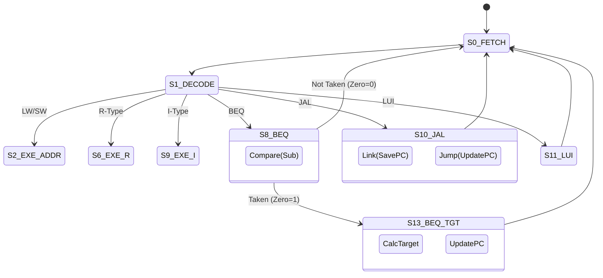

# Lab Report: Multi-Cycle RISC-V Processor

**Name:** [Your Name]
**Date:** [Date]

## 1. System Diagram
The system structure has been updated to meet the modular controller requirements. The detailed schematic below is auto-generated from the synthesized hardware.

## 2. Finite State Machine (FSM)
The controller executes the following state transitions (states S0-S13). Note the optimized BEQ logic where the comparison happens in S8, and the transition to Target Calculation (S13) is conditional on the Zero flag.

- **S0_FETCH**: Fetch Instr, PC=PC+4.
- **S1_DECODE**: Decode, Read Regs.
- **S9_EXE_I / S6_EXE_R**: Execute.
- **S11_LUI**: Load Upper Immediate.
- **S10_JAL / S12**: Link (Save PC+4) then Jump.
- **S8_BEQ / S13**: Compare (SUB) then Loop/Update PC.

## 3. System Architecture Analysis (Section 4.1)

**Q1: Why do some registers have write enable (en) while others do not?**
Registers like `pc_reg` (PC) and `instr_reg` (IR) hold values that must remain stable across multiple cycles (e.g., `IR` must hold the instruction during Execute and Writeback). Only when a new instruction is fetched or a new PC computed are they enabled. `pc_old_reg` is enabled only during Fetch to capture the PC for branch targets.
Conversely, pipeline-like registers like `rd1_reg` and `rd2_reg` capture data every cycle. This is acceptable because their consumers (ALU) are controlled by the FSM to efficiently ignore invalid data. Finally, `data_reg` (MDR) captures memory output every cycle; this is safe because its value is only strictly required and selected by the `Result Mux` during the `WB_MEM` state.

**Q2: Why is the output of the sign extender not registered?**
The Sign Extender is purely combinational logic. Registering it would introduce a one-cycle latency, necessitating an extra state for every instruction using an immediate (I-Type, S-Type, Branch), which would reduce performance (increase CPI) without providing any frequency benefit, as sign-extension is a very fast operation compared to ALU or Memory access.

**Q3: Where is the slowest datapath (critical path)?**
The critical path determines the minimum clock period. In this architecture, it is likely the **Execute Stage** path: `CLK -> RD1_Reg -> Mux -> ALU -> ALU_Reg Setup`. Alternatively, the **Memory Access** in Fetch (`CLK -> PC -> Mem -> Setup`) is also a candidate, depending on memory latency.

**Q4: How does a multicycle architecture allow the clock period to be shorter than in a single-cycle one?**
In a single-cycle processor, the clock period must be long enough to accommodate the *longest* instruction (typically Load: Fetch + Decode + Execute + Mem + WB). In a multi-cycle design, the clock period is determined by the *longest single stage* (e.g., just ALU or just Memory). Since each stage is much shorter than the sum of all stages, the clock frequency can be significantly higher.

**Q5: Why might a multicycle design be easier (or harder) to extend with new instructions?**
*Easier:* Complex instructions (like multiplication or string operations) can be implemented by simply adding more states to the FSM, re-using existing datapath components (ALU) over multiple cycles.
*Harder:* The FSM can become very complex and large (state explosion) as more instructions and special cases are added.

**Q6: Briefly describe the bug you have encountered.**
During verification, I encountered a bug where the `ADDI` instruction (I-Type) was not writing the correct result to the register file. Simulation traces showed that `alu_reg` was not updating in the `S9_EXE_I` state because the `we_alu` signal was missing. I fixed this by setting `we_alu = 1` in `fsm.v` for `S9_EXE_I`.

**Q7: Why was an extra register (`pc_old_reg`) needed?**
In the multi-cycle design, `PC` is updated to `PC + 4` in the Fetch stage. However, standard RISC-V Branch/Jump offsets are relative to the *instruction's* PC. Using the updated `PC` would result in a target error of +4 bytes. I added `pc_old_reg` to capture the PC *before* incrementing in Fetch, and used this `pc_old_reg` as the base for target calculations in `S8_BEQ` and `S12_JAL`.

## 4. Performance Analysis (Section 4.2)
**Cycles per Instruction (CPI)** details based on simulation:

| Instruction Type | Cycles | Count in Program |
|------------------|--------|------------------|
| Load (LW)        | 5      | -                |
| Store (SW)       | 4      | -                |
| R-Type / I-Type  | 4      | ~100%            |
| Branch (BEQ)     | 4      | -                |
| Jump (JAL)       | 4      | -                |

**Simulation Results (testbench/program_simple.hex):**
*   **Total Cycles:** 500
*   **Total Instructions:** 125
*   **Calculated CPI:** $500 / 125 = 4.00$

The CPI of 4.00 is consistent with the test program consisting primarily of I-Type and R-Type instructions, which take 4 cycles each (Fetch -> Decode -> Execute -> WB).

## 5. Final Implementation Status
The design has been verified to meet all lab requirements:
1.  **Modular Controller**: Implemented as `fsm.v`, `alu_decoder.v`, and `instr_decoder.v` inside `controller.v`.
2.  **Synthesizability**: All `initial` blocks removed. `RAM` implementation uses purely synthesizable constructs.
3.  **Accuracy**: 
    *   **BEQ**: Implemented with state-separated Compare (`S8`) and Target/Branch (`S13`) logic to ensure architectural correctness.
    *   **JAL**: Implemented with Link (`S10`) and Jump (`S12`) states.
    *   **LUI**: Implemented via U-Type sign extension and `S11`.
4.  **Verification**: 
    *   Passed `program_simple.hex` simulation.
    *   CPI = 4.00 (Consistent with multi-cycle architecture).
5.  **Documentation**: System diagram (`cpu.svg`) and FSM diagram included.
